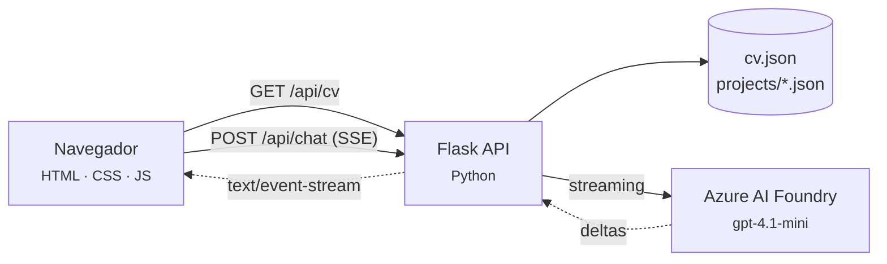

# Portafolio — Jhonatan Rodriguez Custodio

Portafolio profesional de un **AI Engineer** especializado en sistemas RAG multimodales
y arquitecturas multiagente sobre Microsoft Azure.

Incluye un asistente conversacional propio: un modelo desplegado en **Azure AI Foundry**
que conoce el CV y responde preguntas de reclutadores en tiempo real, con respuesta
token a token y control de consumo.

<p align="center">
  
  
  
  
  
</p>

---

## Características

| | |
|---|---|
| **Asistente IA con streaming** | Respuestas token a token vía Server-Sent Events, con métricas de tokens y latencia |
| **Contexto del CV** | El modelo recibe el CV completo como fuente de verdad, sin fine-tuning ni base vectorial |
| **Control de consumo** | 5 preguntas cada 24 h por IP, en ventana deslizante, para acotar el gasto de tokens |
| **Modales de arquitectura** | Cada proyecto muestra su diagrama por capas, flujo y servicios utilizados |
| **Contenido dirigido por datos** | Agregar un proyecto es añadir un JSON: cero cambios en el frontend |
| **Responsive real** | Drawer lateral, bottom sheet, safe areas y objetivos táctiles de 44 px |
| **Sin dependencias de UI** | JavaScript nativo con módulos ES6. Sin framework ni paso de build |

---

## Arquitectura



La clave de seguridad nunca llega al navegador: el frontend habla con Flask, y solo
Flask conoce las credenciales de Azure.

### Dos vistas del mismo dato

El detalle de arquitectura pesa mucho y no aporta a la conversación, así que se separan
las rutas según quién consume:

| Función | Consumidor | Contenido | Tamaño |
|---|---|---|---|
| `load_cv()` | Web (modales) | CV + proyectos completos | ~9.850 tokens |
| `load_cv_brief()` | Asistente IA | CV + proyectos resumidos | ~3.340 tokens |

Enviar el detalle completo en cada pregunta costaría **6.500 tokens extra por consulta**.

---

## Estructura

```
.
├── backend/
│   ├── app.py                    # Factory de Flask
│   ├── config.py                 # Configuración desde variables de entorno
│   ├── data/
│   │   ├── cv.json               # Perfil, experiencia, skills, certificaciones
│   │   └── projects/             # Un archivo por proyecto
│   │       ├── 01-gys-avi.json
│   │       └── ...
│   ├── routes/api.py             # Endpoints REST + stream SSE
│   └── services/
│       ├── cv_service.py         # Carga y cachea los datos
│       ├── chat_service.py       # Prompt del asistente y streaming
│       └── rate_limiter.py       # Cuota por IP en ventana deslizante
│
└── frontend/
    ├── index.html
    ├── css/
    │   ├── base.css              # Tokens de diseño y reset
    │   ├── layout.css            # Estructura de página
    │   ├── components/           # Un archivo por componente
    │   │   ├── ui.css
    │   │   ├── cards.css
    │   │   ├── timeline.css
    │   │   ├── contact.css
    │   │   ├── modal.css
    │   │   ├── diagram.css
    │   │   └── chat.css
    │   ├── responsive.css        # Reflujo por breakpoint
    │   └── mobile.css            # Patrones exclusivos de móvil
    └── js/
        ├── main.js               # Punto de entrada
        ├── api.js                # Cliente HTTP y lector SSE
        ├── render.js             # Renderizado de secciones
        ├── chat.js               # Widget del asistente
        ├── ui.js                 # Navegación, scroll, animaciones
        └── components/
            ├── modal.js          # Contenedor accesible reutilizable
            ├── diagram.js        # Diagrama de arquitectura
            ├── project-detail.js # Composición de secciones
            └── project-modal.js  # Orquestador
```

---

## Puesta en marcha

### Requisitos

- Python 3.13+
- [uv](https://docs.astral.sh/uv/) (o `pip`)
- Un modelo desplegado en Azure AI Foundry

### 1. Instalar dependencias

```bash
uv venv .venv
source .venv/bin/activate          # Windows: .venv\Scripts\activate
uv pip install -r backend/requirements.txt
```

### 2. Configurar credenciales

```bash
cp backend/.env.example backend/.env
```

Edita `backend/.env`:

```ini
AZURE_AI_ENDPOINT=https://<tu-recurso>.services.ai.azure.com/openai/v1
AZURE_AI_API_KEY=<tu-clave>
AZURE_AI_DEPLOYMENT=gpt-4.1-mini

CHAT_MAX_QUESTIONS=5
CHAT_WINDOW_HOURS=24

PORT=5000
FLASK_DEBUG=1
CORS_ORIGINS=*
```

> `.env` está en `.gitignore`. Nunca subas tus claves al repositorio.

### 3. Levantar los servicios

```bash
# Terminal 1 — API
cd backend && python app.py

# Terminal 2 — Frontend
cd frontend && python3 -m http.server 8080
```

Abre <http://localhost:8080>.

---

## API

| Método | Ruta | Descripción |
|---|---|---|
| `GET` | `/api/cv` | CV completo con proyectos y arquitecturas |
| `GET` | `/api/<sección>` | Sección concreta (`profile`, `experience`, `skills`, `projects`…) |
| `GET` | `/api/chat/quota` | Preguntas restantes y modelo activo |
| `POST` | `/api/chat` | Respuesta del asistente como `text/event-stream` |

### Eventos del stream

```
event: start   → { model, remaining }
event: delta   → { text }              ← se repite por cada token
event: usage   → { input, output, total }
event: done    → { latency, remaining }
event: error   → { error }
```

---

## Agregar un proyecto

Crea un archivo en `backend/data/projects/` siguiendo el orden numérico.
**No hay que tocar el frontend**: las secciones se resuelven por convención.

```jsonc
{
  "id": "mi-proyecto",
  "title": "Mi Proyecto — Subtítulo",
  "category": "RAG / GenAI",
  "status": "Producción",
  "region": "East US 2",
  "description": "Resumen en una o dos frases.",
  "problem": "Qué problema resuelve y con qué impacto.",
  "tech": ["Azure OpenAI", "Azure AI Search"],

  "architecture": {
    "caption": "Descripción del diagrama.",
    "layers": [
      {
        "name": "Capa de aplicación",
        "nodes": [
          { "name": "Azure App Service", "detail": "Backend Python", "kind": "compute" }
        ]
      }
    ]
  },

  "flow": ["Paso 1 del flujo.", "Paso 2 del flujo."],
  "components": [{ "name": "Azure OpenAI", "role": "Modelos de chat y embeddings." }],
  "insight": { "title": "Decisión de arquitectura", "text": "Por qué se eligió este enfoque." }
}
```

Los campos `architecture`, `flow`, `components` e `insight` son opcionales: si faltan,
su sección simplemente no se pinta.

### Tipos de nodo (`kind`)

Determinan el color en el diagrama:

`user` · `compute` · `ai` · `data` · `security` · `observability` · `integration`

---

## Decisiones de diseño

**Un componente de modal, no uno por proyecto.**
Ocho proyectos con archivo propio serían ocho ficheros casi idénticos, y el noveno
obligaría a escribir código nuevo. En su lugar, `project-detail.js` declara las
secciones una sola vez y las resuelve contra el JSON:

```js
const SECTIONS = [
  { key: "problem",      title: "Problema que resuelve", render: renderParagraph },
  { key: "architecture", title: "Arquitectura",          render: buildDiagram },
  { key: "flow",         title: "Flujo de la solución",  render: renderFlow },
  { key: "components",   title: "Servicios utilizados",  render: renderComponents },
];
```

**Sin `innerHTML`.**
Todo el DOM se construye con `createElement` y `textContent`, lo que elimina por
diseño la superficie de XSS.

**CSS separado por responsabilidad, no por dispositivo.**
Duplicar componentes para móvil implicaría mantener el contenido dos veces y perjudicaría
el SEO. Se usa un solo DOM con `responsive.css` (reflujo) y `mobile.css` (patrones que
en escritorio no existen: drawer, bottom sheet, safe areas).

**La cuota se cobra solo si el modelo responde.**
Un fallo del servicio no consume preguntas del visitante.

---

## Despliegue

**Frontend** → Azure Static Web Apps, Netlify, Vercel o GitHub Pages.
Actualiza `API_URL` en `frontend/js/config.js` con la URL pública de tu API.

**Backend** → PythonAnywhere, Azure App Service o Container Apps.
Define las variables de entorno en el panel del proveedor y restringe `CORS_ORIGINS`
al dominio de tu frontend.

> El limitador vive en memoria: se reinicia con el proceso y no se comparte entre
> instancias. Para escalado horizontal, moverlo a Redis o Cosmos DB.

---

## Contacto

**Jhonatan Rodriguez Custodio** — AI Engineer

[](mailto:jhonatan9494c@gmail.com)
[](https://www.linkedin.com/in/jrc03/)
[](https://github.com/JhonatanRC03)
[](https://wa.me/51968677769)

### Certificaciones Microsoft

`AI-102` · `DP-100` · `AB-731` · `AB-730` · `AI-900` · `DP-900`

---

<sub>Los proyectos mostrados corresponden a soluciones desarrolladas en entornos
corporativos. Se documentan sus arquitecturas y decisiones técnicas sin exponer
aplicaciones, datos ni entidades cliente.</sub>
